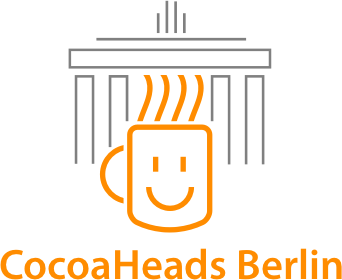

#Welcome to Berlin CocoaHeads!

We are the Berlin chapter of [Cocoaheads](http://www.cocoaheads.org). We meet once every month and talk about iOS and OS X development. If you're into Cocoa and in Berlin, come in and say Hi!

For upcoming events find us on [Meetup](http://www.meetup.com/Cocoaheads-Berlin/)

Follow us on Twitter: [@cocoaheads_BER](https://twitter.com/cocoaheads_BER)

Watch our talks on [YouTube](https://www.youtube.com/channel/UCJ0JUzZs0HRsvaUwEUjGDTA) or [Vimeo (Deprecated)](https://vimeo.com/channels/cocoaheadsberlin)

## Notes

Test page locally:

	$ bundle exec jekyll serve

Social Icons from [Perfect Icons](https://perfecticons.com/)

CocoaHeads Berlin Logo and Website designed by [Reiner Pittinger](https://github.com/rpitting)